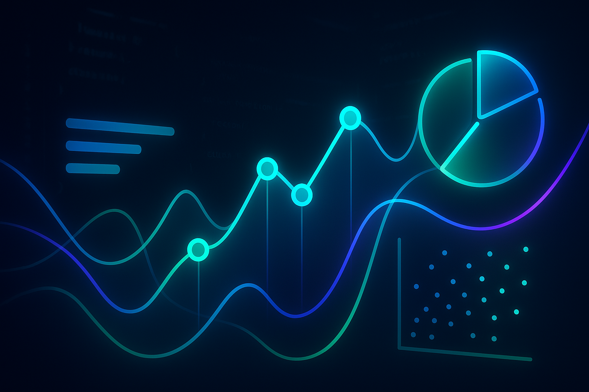

# Interactive Data Visualization JS


## 🖼️ Imagem Hero



---

## PT-BR

Plataforma avançada de visualização de dados interativa construída com JavaScript vanilla e múltiplas bibliotecas de gráficos, oferecendo performance otimizada, animações fluidas e interatividade em tempo real para aplicações web modernas.

## 🎯 Visão Geral

Sistema completo de visualização de dados que combina Chart.js, D3.js, Canvas e WebGL para criar experiências visuais interativas de alta performance, com suporte a grandes volumes de dados e atualizações em tempo real.

### ✨ Características Principais

- **🚀 Performance Otimizada**: Renderização Canvas e WebGL para grandes datasets
- **🎨 Múltiplas Bibliotecas**: Chart.js, D3.js, Three.js integradas
- **⚡ Tempo Real**: WebSocket e Server-Sent Events
- **🎛️ Interatividade Avançada**: Zoom, pan, brush, drill-down
- **📱 Responsivo**: Adaptável a qualquer dispositivo
- **🔄 Animações Fluidas**: 60fps com requestAnimationFrame

## 🛠️ Stack Tecnológico

### Core Technologies
- **JavaScript ES2022**: Linguagem moderna com features avançadas
- **Canvas API**: Renderização 2D de alta performance
- **WebGL**: Aceleração gráfica 3D
- **Web Workers**: Processamento paralelo

### Visualization Libraries
- **Chart.js**: Gráficos responsivos e animados
- **D3.js**: Visualizações customizadas
- **Three.js**: Gráficos 3D e WebGL
- **Plotly.js**: Gráficos científicos interativos

### Real-time & Performance
- **WebSocket**: Comunicação bidirecional
- **Server-Sent Events**: Streaming de dados
- **IndexedDB**: Cache local de dados
- **Web Workers**: Processamento em background

## 📁 Estrutura do Projeto

```
Interactive-Data-Visualization-JS/
├── src/                            # Código fonte
│   ├── core/                       # Módulos principais
│   │   ├── DataEngine.js           # Engine de dados
│   │   ├── RenderEngine.js         # Engine de renderização
│   │   ├── InteractionEngine.js    # Engine de interação
│   │   └── AnimationEngine.js      # Engine de animações
│   ├── charts/                     # Componentes de gráficos
│   │   ├── CanvasChart.js          # Gráficos Canvas
│   │   ├── WebGLChart.js           # Gráficos WebGL
│   │   ├── SVGChart.js             # Gráficos SVG
│   │   └── HybridChart.js          # Gráficos híbridos
│   ├── visualizations/             # Visualizações específicas
│   │   ├── ScatterPlot3D.js        # Scatter plot 3D
│   │   ├── NetworkGraph.js         # Gráfico de rede
│   │   ├── Heatmap.js              # Mapa de calor
│   │   └── TreeMap.js              # Tree map
│   ├── interactions/               # Módulos de interação
│   │   ├── ZoomPan.js              # Zoom e pan
│   │   ├── Brush.js                # Seleção por área
│   │   ├── Tooltip.js              # Tooltips avançados
│   │   └── Crossfilter.js          # Filtros cruzados
│   ├── data/                       # Processamento de dados
│   │   ├── DataLoader.js           # Carregamento de dados
│   │   ├── DataProcessor.js        # Processamento
│   │   ├── DataStreamer.js         # Streaming
│   │   └── DataCache.js            # Cache inteligente
│   ├── utils/                      # Utilitários
│   │   ├── Performance.js          # Monitoramento de performance
│   │   ├── WebWorkers.js           # Web workers
│   │   ├── Formatters.js           # Formatadores
│   │   └── Math.js                 # Funções matemáticas
│   └── main.js                     # Ponto de entrada
├── workers/                        # Web Workers
│   ├── dataProcessor.worker.js     # Processamento de dados
│   ├── calculator.worker.js        # Cálculos pesados
│   └── renderer.worker.js          # Renderização off-screen
├── shaders/                        # Shaders WebGL
│   ├── vertex.glsl                 # Vertex shaders
│   └── fragment.glsl               # Fragment shaders
├── assets/                         # Assets estáticos
├── examples/                       # Exemplos de uso
├── tests/                          # Testes automatizados
├── index.html                      # HTML principal
└── README.md                       # Documentação
```

## 🚀 Quick Start

### Pré-requisitos

- Navegador moderno com suporte a ES2022
- WebGL 2.0 (opcional, para gráficos 3D)

### Instalação

1. **Clone o repositório:**
```bash
git clone https://github.com/galafis/Interactive-Data-Visualization-JS.git
cd Interactive-Data-Visualization-JS
```

2. **Abra no navegador:**
```bash
# Usando Python
python -m http.server 8000

# Usando Node.js
npx serve .

# Ou qualquer servidor local
```

3. **Acesse a aplicação:**
```
http://localhost:8000
```

## 📊 Componentes de Visualização

### Canvas Chart de Alta Performance
```javascript
import { CanvasChart } from './charts/CanvasChart.js';

// Gráfico Canvas para grandes datasets
const canvasChart = new CanvasChart({
  container: '#canvas-container',
  width: 1200,
  height: 600,
  data: largeDataset, // 100k+ pontos
  type: 'scatter'
});

// Configurar renderização otimizada
canvasChart
  .enableQuadTree(true)  // Otimização espacial
  .enableLOD(true)       // Level of Detail
  .setPointSize(2)
  .setAlpha(0.7)
  .render();

// Interatividade
canvasChart.on('zoom', (scale) => {
  // Ajustar LOD baseado no zoom
  const pointSize = Math.max(1, 2 / scale);
  canvasChart.setPointSize(pointSize);
});
```

### WebGL 3D Visualization
```javascript
import { WebGLChart } from './charts/WebGLChart.js';

// Visualização 3D com WebGL
const webglChart = new WebGLChart({
  container: '#webgl-container',
  width: 800,
  height: 600,
  camera: {
    position: [0, 0, 5],
    target: [0, 0, 0]
  }
});

// Configurar geometria e materiais
webglChart
  .addGeometry('points', {
    positions: pointPositions,
    colors: pointColors,
    sizes: pointSizes
  })
  .addMaterial('points', {
    type: 'PointsMaterial',
    size: 0.1,
    transparent: true,
    alphaTest: 0.1
  })
  .render();

// Animação contínua
webglChart.animate((time) => {
  // Rotação automática
  webglChart.camera.position.x = Math.cos(time * 0.001) * 5;
  webglChart.camera.position.z = Math.sin(time * 0.001) * 5;
});
```

### Hybrid Chart System
```javascript
import { HybridChart } from './charts/HybridChart.js';

// Sistema híbrido: SVG + Canvas + WebGL
const hybridChart = new HybridChart({
  container: '#hybrid-container',
  layers: {
    background: 'canvas',  // Fundo em Canvas
    data: 'webgl',         // Dados em WebGL
    ui: 'svg'              // Interface em SVG
  }
});

// Configurar cada camada
hybridChart
  .configureLayer('background', {
    type: 'grid',
    color: '#f0f0f0',
    spacing: 50
  })
  .configureLayer('data', {
    type: 'scatter3d',
    data: dataset,
    pointSize: 2
  })
  .configureLayer('ui', {
    axes: true,
    labels: true,
    legend: true
  })
  .render();
```

## 🔄 Dados em Tempo Real

### WebSocket Streaming
```javascript
import { DataStreamer } from './data/DataStreamer.js';

// Configurar streaming de dados
const streamer = new DataStreamer({
  url: 'ws://localhost:8080/data-stream',
  bufferSize: 1000,
  updateInterval: 16 // 60fps
});

// Processar dados em tempo real
streamer.on('data', (newData) => {
  // Adicionar ao buffer circular
  dataBuffer.add(newData);
  
  // Atualizar visualização
  chart.updateData(dataBuffer.getVisible());
});

// Controle de qualidade
streamer.on('congestion', () => {
  // Reduzir qualidade em caso de congestionamento
  chart.setLOD('low');
});
```

### Server-Sent Events
```javascript
import { EventSource } from './data/EventSource.js';

// Streaming unidirecional
const eventSource = new EventSource('/api/metrics-stream');

eventSource.addEventListener('metrics', (event) => {
  const metrics = JSON.parse(event.data);
  
  // Atualizar dashboard em tempo real
  updateMetricsDashboard(metrics);
});

eventSource.addEventListener('alert', (event) => {
  const alert = JSON.parse(event.data);
  
  // Destacar anomalias
  highlightAnomaly(alert);
});
```

## ⚡ Performance e Otimização

### Web Workers para Processamento
```javascript
// dataProcessor.worker.js
self.onmessage = function(e) {
  const { data, operation } = e.data;
  
  let result;
  switch(operation) {
    case 'aggregate':
      result = aggregateData(data);
      break;
    case 'filter':
      result = filterData(data, e.data.filters);
      break;
    case 'cluster':
      result = clusterData(data, e.data.options);
      break;
  }
  
  self.postMessage({ result, operation });
};

// Uso no thread principal
const worker = new Worker('./workers/dataProcessor.worker.js');

worker.postMessage({
  data: largeDataset,
  operation: 'cluster',
  options: { k: 5, algorithm: 'kmeans' }
});

worker.onmessage = (e) => {
  const { result } = e.data;
  updateVisualization(result);
};
```

### Level of Detail (LOD)
```javascript
class LODManager {
  constructor(chart) {
    this.chart = chart;
    this.levels = {
      high: { pointSize: 3, alpha: 1.0, maxPoints: 10000 },
      medium: { pointSize: 2, alpha: 0.8, maxPoints: 50000 },
      low: { pointSize: 1, alpha: 0.6, maxPoints: 100000 }
    };
  }

  updateLOD(zoomLevel, dataSize) {
    let level = 'high';
    
    if (dataSize > 50000 || zoomLevel < 0.5) {
      level = 'low';
    } else if (dataSize > 10000 || zoomLevel < 1.0) {
      level = 'medium';
    }
    
    this.applyLOD(level);
  }

  applyLOD(level) {
    const config = this.levels[level];
    this.chart.setPointSize(config.pointSize);
    this.chart.setAlpha(config.alpha);
    
    // Subsampling se necessário
    if (this.chart.dataSize > config.maxPoints) {
      this.chart.enableSubsampling(config.maxPoints);
    }
  }
}
```

### Spatial Indexing
```javascript
class QuadTree {
  constructor(bounds, maxPoints = 10, maxDepth = 5) {
    this.bounds = bounds;
    this.maxPoints = maxPoints;
    this.maxDepth = maxDepth;
    this.points = [];
    this.divided = false;
  }

  insert(point) {
    if (!this.contains(point)) return false;
    
    if (this.points.length < this.maxPoints && !this.divided) {
      this.points.push(point);
      return true;
    }
    
    if (!this.divided) {
      this.subdivide();
    }
    
    return (
      this.northeast.insert(point) ||
      this.northwest.insert(point) ||
      this.southeast.insert(point) ||
      this.southwest.insert(point)
    );
  }

  query(range) {
    const found = [];
    
    if (!this.intersects(range)) return found;
    
    for (let point of this.points) {
      if (range.contains(point)) {
        found.push(point);
      }
    }
    
    if (this.divided) {
      found.push(...this.northeast.query(range));
      found.push(...this.northwest.query(range));
      found.push(...this.southeast.query(range));
      found.push(...this.southwest.query(range));
    }
    
    return found;
  }
}
```

## 🎛️ Interatividade Avançada

### Zoom e Pan Otimizado
```javascript
class ZoomPanController {
  constructor(chart) {
    this.chart = chart;
    this.transform = { x: 0, y: 0, scale: 1 };
    this.setupEventListeners();
  }

  setupEventListeners() {
    const canvas = this.chart.canvas;
    
    // Wheel zoom
    canvas.addEventListener('wheel', (e) => {
      e.preventDefault();
      
      const rect = canvas.getBoundingClientRect();
      const x = e.clientX - rect.left;
      const y = e.clientY - rect.top;
      
      const scaleFactor = e.deltaY > 0 ? 0.9 : 1.1;
      this.zoomAt(x, y, scaleFactor);
    });
    
    // Touch gestures
    let lastTouches = [];
    canvas.addEventListener('touchmove', (e) => {
      e.preventDefault();
      
      if (e.touches.length === 2) {
        const touch1 = e.touches[0];
        const touch2 = e.touches[1];
        
        if (lastTouches.length === 2) {
          const lastDistance = this.getDistance(lastTouches[0], lastTouches[1]);
          const currentDistance = this.getDistance(touch1, touch2);
          const scaleFactor = currentDistance / lastDistance;
          
          const centerX = (touch1.clientX + touch2.clientX) / 2;
          const centerY = (touch1.clientY + touch2.clientY) / 2;
          
          this.zoomAt(centerX, centerY, scaleFactor);
        }
      }
      
      lastTouches = Array.from(e.touches);
    });
  }

  zoomAt(x, y, scaleFactor) {
    const newScale = this.transform.scale * scaleFactor;
    
    // Limitar zoom
    if (newScale < 0.1 || newScale > 10) return;
    
    // Ajustar posição para zoom no ponto
    this.transform.x = x - (x - this.transform.x) * scaleFactor;
    this.transform.y = y - (y - this.transform.y) * scaleFactor;
    this.transform.scale = newScale;
    
    this.chart.setTransform(this.transform);
    this.chart.render();
  }
}
```

### Brush Selection
```javascript
class BrushSelector {
  constructor(chart) {
    this.chart = chart;
    this.isSelecting = false;
    this.selection = null;
    this.setupBrush();
  }

  setupBrush() {
    const canvas = this.chart.canvas;
    
    canvas.addEventListener('mousedown', (e) => {
      if (e.shiftKey) {
        this.startSelection(e);
      }
    });
    
    canvas.addEventListener('mousemove', (e) => {
      if (this.isSelecting) {
        this.updateSelection(e);
      }
    });
    
    canvas.addEventListener('mouseup', (e) => {
      if (this.isSelecting) {
        this.endSelection(e);
      }
    });
  }

  startSelection(e) {
    this.isSelecting = true;
    const rect = this.chart.canvas.getBoundingClientRect();
    this.selection = {
      startX: e.clientX - rect.left,
      startY: e.clientY - rect.top,
      endX: e.clientX - rect.left,
      endY: e.clientY - rect.top
    };
  }

  updateSelection(e) {
    const rect = this.chart.canvas.getBoundingClientRect();
    this.selection.endX = e.clientX - rect.left;
    this.selection.endY = e.clientY - rect.top;
    
    this.drawSelectionBox();
  }

  endSelection(e) {
    this.isSelecting = false;
    
    // Encontrar pontos na seleção
    const selectedPoints = this.chart.getPointsInRect(this.selection);
    
    // Emitir evento
    this.chart.emit('selection', selectedPoints);
    
    // Limpar seleção visual
    this.clearSelectionBox();
  }
}
```

## 🧪 Testes e Validação

### Performance Testing
```javascript
class PerformanceMonitor {
  constructor() {
    this.metrics = {
      fps: 0,
      renderTime: 0,
      memoryUsage: 0
    };
    this.frameCount = 0;
    this.lastTime = performance.now();
  }

  startFrame() {
    this.frameStart = performance.now();
  }

  endFrame() {
    const now = performance.now();
    this.metrics.renderTime = now - this.frameStart;
    
    this.frameCount++;
    if (now - this.lastTime >= 1000) {
      this.metrics.fps = this.frameCount;
      this.frameCount = 0;
      this.lastTime = now;
      
      // Monitorar memória
      if (performance.memory) {
        this.metrics.memoryUsage = performance.memory.usedJSHeapSize;
      }
      
      this.reportMetrics();
    }
  }

  reportMetrics() {
    console.log(`FPS: ${this.metrics.fps}, Render: ${this.metrics.renderTime.toFixed(2)}ms`);
    
    // Alertar se performance baixa
    if (this.metrics.fps < 30) {
      console.warn('Low FPS detected, consider reducing quality');
    }
  }
}
```

### Unit Tests
```javascript
// tests/chart.test.js
import { CanvasChart } from '../src/charts/CanvasChart.js';

describe('CanvasChart', () => {
  let chart;
  let container;

  beforeEach(() => {
    container = document.createElement('div');
    document.body.appendChild(container);
    
    chart = new CanvasChart({
      container: container,
      width: 400,
      height: 300
    });
  });

  afterEach(() => {
    document.body.removeChild(container);
  });

  test('should create canvas element', () => {
    expect(container.querySelector('canvas')).toBeTruthy();
  });

  test('should render data points', () => {
    const data = [
      { x: 10, y: 20 },
      { x: 30, y: 40 }
    ];
    
    chart.setData(data);
    chart.render();
    
    expect(chart.getRenderedPointCount()).toBe(2);
  });

  test('should handle zoom correctly', () => {
    chart.zoom(2);
    expect(chart.getScale()).toBe(2);
  });
});
```

## 📊 Casos de Uso Avançados

### 1. Real-time Trading Dashboard
- Gráficos de candlestick em tempo real
- Indicadores técnicos sobrepostos
- Volume e profundidade de mercado

### 2. Scientific Data Exploration
- Scatter plots 3D para análise multivariada
- Heatmaps de correlação
- Séries temporais com múltiplas variáveis

### 3. IoT Monitoring Platform
- Dashboards de sensores em tempo real
- Mapas geográficos com dados de telemetria
- Alertas visuais para anomalias

## 📄 Licença

Este projeto está licenciado sob a Licença MIT - veja o arquivo [LICENSE](LICENSE) para detalhes.

## 👨‍💻 Autor

**Gabriel Demetrios Lafis**

- GitHub: [@galafis](https://github.com/galafis)
- Email: gabrieldemetrios@gmail.com

---

⭐ Se este projeto foi útil, considere deixar uma estrela!

---

## EN-US

Advanced interactive data visualization platform built with vanilla JavaScript and multiple charting libraries, offering optimized performance, fluid animations, and real-time interactivity for modern web applications.

## 🎯 Overview

Complete data visualization system combining Chart.js, D3.js, Canvas, and WebGL to create high-performance interactive visual experiences, with support for large volumes of data and real-time updates.

### ✨ Key Features

- **🚀 Optimized Performance**: Canvas and WebGL rendering for large datasets
- **🎨 Multiple Libraries**: Chart.js, D3.js, Three.js integrated
- **⚡ Real-time**: WebSocket and Server-Sent Events
- **🎛️ Advanced Interactivity**: Zoom, pan, brush, drill-down
- **📱 Responsive**: Adaptable to any device
- **🔄 Fluid Animations**: 60fps with requestAnimationFrame

## 🛠️ Tech Stack

### Core Technologies
- **JavaScript ES2022**: Modern language with advanced features
- **Canvas API**: High-performance 2D rendering
- **WebGL**: 3D graphics acceleration
- **Web Workers**: Parallel processing

### Visualization Libraries
- **Chart.js**: Responsive and animated charts
- **D3.js**: Custom visualizations
- **Three.js**: 3D graphics and WebGL
- **Plotly.js**: Interactive scientific charts

### Real-time & Performance
- **WebSocket**: Bidirectional communication
- **Server-Sent Events**: Data streaming
- **IndexedDB**: Local data cache
- **Web Workers**: Background processing

## 📁 Project Structure

```
Interactive-Data-Visualization-JS/
├── src/                            # Source code
│   ├── core/                       # Core modules
│   │   ├── DataEngine.js           # Data engine
│   │   ├── RenderEngine.js         # Rendering engine
│   │   ├── InteractionEngine.js    # Interaction engine
│   │   └── AnimationEngine.js      # Animation engine
│   ├── charts/                     # Chart components
│   │   ├── CanvasChart.js          # Canvas charts
│   │   ├── WebGLChart.js           # WebGL charts
│   │   ├── SVGChart.js             # SVG charts
│   │   └── HybridChart.js          # Hybrid charts
│   ├── visualizations/             # Specific visualizations
│   │   ├── ScatterPlot3D.js        # 3D Scatter plot
│   │   ├── NetworkGraph.js         # Network graph
│   │   ├── Heatmap.js              # Heatmap
│   │   └── TreeMap.js              # Tree map
│   ├── interactions/               # Interaction modules
│   │   ├── ZoomPan.js              # Zoom and pan
│   │   ├── Brush.js                # Area selection
│   │   ├── Tooltip.js              # Advanced tooltips
│   │   └── Crossfilter.js          # Cross-filters
│   ├── data/                       # Data processing
│   │   ├── DataLoader.js           # Data loading
│   │   ├── DataProcessor.js        # Processing
│   │   ├── DataStreamer.js         # Streaming
│   │   └── DataCache.js            # Smart cache
│   ├── utils/                      # Utilities
│   │   ├── Performance.js          # Performance monitoring
│   │   ├── WebWorkers.js           # Web workers
│   │   ├── Formatters.js           # Formatters
│   │   └── Math.js                 # Math functions
│   └── main.js                     # Entry point
├── workers/                        # Web Workers
│   ├── dataProcessor.worker.js     # Data processing
│   ├── calculator.worker.js        # Heavy calculations
│   └── renderer.worker.js          # Off-screen rendering
├── shaders/                        # WebGL Shaders
│   ├── vertex.glsl                 # Vertex shaders
│   └── fragment.glsl               # Fragment shaders
├── assets/                         # Static assets
├── examples/                       # Usage examples
├── tests/                          # Automated tests
├── index.html                      # Main HTML
└── README.md                       # Documentation
```

## 🚀 Quick Start

### Prerequisites

- Modern browser with ES2022 support
- WebGL 2.0 (optional, for 3D graphics)

### Installation

1. **Clone the repository:**
```bash
git clone https://github.com/galafis/Interactive-Data-Visualization-JS.git
cd Interactive-Data-Visualization-JS
```

2. **Open in browser:**
```bash
# Using Python
python -m http.server 8000

# Using Node.js
npx serve .

# Or any local server
```

3. **Access the application:**
```
http://localhost:8000
```

## 📊 Visualization Components

### High-Performance Canvas Chart
```javascript
import { CanvasChart } from './charts/CanvasChart.js';

// Canvas chart for large datasets
const canvasChart = new CanvasChart({
  container: '#canvas-container',
  width: 1200,
  height: 600,
  data: largeDataset, // 100k+ points
  type: 'scatter'
});

// Configure optimized rendering
canvasChart
  .enableQuadTree(true)  // Spatial optimization
  .enableLOD(true)       // Level of Detail
  .setPointSize(2)
  .setAlpha(0.7)
  .render();

// Interactivity
canvasChart.on('zoom', (scale) => {
  // Adjust LOD based on zoom
  const pointSize = Math.max(1, 2 / scale);
  canvasChart.setPointSize(pointSize);
});
```

### WebGL 3D Visualization
```javascript
import { WebGLChart } from './charts/WebGLChart.js';

// 3D visualization with WebGL
const webglChart = new WebGLChart({
  container: '#webgl-container',
  width: 800,
  height: 600,
  camera: {
    position: [0, 0, 5],
    target: [0, 0, 0]
  }
});

// Configure geometry and materials
webglChart
  .addGeometry('points', {
    positions: pointPositions,
    colors: pointColors,
    sizes: pointSizes
  })
  .addMaterial('points', {
    type: 'PointsMaterial',
    size: 0.1,
    transparent: true,
    alphaTest: 0.1
  })
  .render();

// Continuous animation
webglChart.animate((time) => {
  // Automatic rotation
  webglChart.camera.position.x = Math.cos(time * 0.001) * 5;
  webglChart.camera.position.z = Math.sin(time * 0.001) * 5;
});
```

### Hybrid Chart System
```javascript
import { HybridChart } from './charts/HybridChart.js';

// Hybrid system: SVG + Canvas + WebGL
const hybridChart = new HybridChart({
  container: '#hybrid-container',
  layers: {
    background: 'canvas',  // Canvas background
    data: 'webgl',         // WebGL data
    ui: 'svg'              // SVG interface
  }
});

// Configure each layer
hybridChart
  .configureLayer('background', {
    type: 'grid',
    color: '#f0f0f0',
    spacing: 50
  })
  .configureLayer('data', {
    type: 'scatter3d',
    data: dataset,
    pointSize: 2
  })
  .configureLayer('ui', {
    axes: true,
    labels: true,
    legend: true
  })
  .render();
```

## 🔄 Real-time Data

### WebSocket Streaming
```javascript
import { DataStreamer } from './data/DataStreamer.js';

// Configure data streaming
const streamer = new DataStreamer({
  url: 'ws://localhost:8080/data-stream',
  bufferSize: 1000,
  updateInterval: 16 // 60fps
});

// Process real-time data
streamer.on('data', (newData) => {
  // Add to circular buffer
  dataBuffer.add(newData);
  
  // Update visualization
  chart.updateData(dataBuffer.getVisible());
});

// Quality control
streamer.on('congestion', () => {
  // Reduce quality in case of congestion
  chart.setLOD('low');
});
```

### Server-Sent Events
```javascript
import { EventSource } from './data/EventSource.js';

// Unidirectional streaming
const eventSource = new EventSource('/api/metrics-stream');

eventSource.addEventListener('metrics', (event) => {
  const metrics = JSON.parse(event.data);
  
  // Update real-time dashboard
  updateMetricsDashboard(metrics);
});

eventSource.addEventListener('alert', (event) => {
  const alert = JSON.parse(event.data);
  
  // Highlight anomalies
  highlightAnomaly(alert);
});
```

## ⚡ Performance and Optimization

### Web Workers for Processing
```javascript
// dataProcessor.worker.js
self.onmessage = function(e) {
  const { data, operation } = e.data;
  
  let result;
  switch(operation) {
    case 'aggregate':
      result = aggregateData(data);
      break;
    case 'filter':
      result = filterData(data, e.data.filters);
      break;
    case 'cluster':
      result = clusterData(data, e.data.options);
      break;
  }
  
  self.postMessage({ result, operation });
};

// Usage in main thread
const worker = new Worker('./workers/dataProcessor.worker.js');

worker.postMessage({
  data: largeDataset,
  operation: 'cluster',
  options: { k: 5, algorithm: 'kmeans' }
});

worker.onmessage = (e) => {
  const { result } = e.data;
  updateVisualization(result);
};
```

### Level of Detail (LOD)
```javascript
class LODManager {
  constructor(chart) {
    this.chart = chart;
    this.levels = {
      high: { pointSize: 3, alpha: 1.0, maxPoints: 10000 },
      medium: { pointSize: 2, alpha: 0.8, maxPoints: 50000 },
      low: { pointSize: 1, alpha: 0.6, maxPoints: 100000 }
    };
  }

  updateLOD(zoomLevel, dataSize) {
    let level = 'high';
    
    if (dataSize > 50000 || zoomLevel < 0.5) {
      level = 'low';
    } else if (dataSize > 10000 || zoomLevel < 1.0) {
      level = 'medium';
    }
    
    this.applyLOD(level);
  }

  applyLOD(level) {
    const config = this.levels[level];
    this.chart.setPointSize(config.pointSize);
    this.chart.setAlpha(config.alpha);
    
    // Subsampling if necessary
    if (this.chart.dataSize > config.maxPoints) {
      this.chart.enableSubsampling(config.maxPoints);
    }
  }
}
```

### Spatial Indexing
```javascript
class QuadTree {
  constructor(bounds, maxPoints = 10, maxDepth = 5) {
    this.bounds = bounds;
    this.maxPoints = maxPoints;
    this.maxDepth = maxDepth;
    this.points = [];
    this.divided = false;
  }

  insert(point) {
    if (!this.contains(point)) return false;
    
    if (this.points.length < this.maxPoints && !this.divided) {
      this.points.push(point);
      return true;
    }
    
    if (!this.divided) {
      this.subdivide();
    }
    
    return (
      this.northeast.insert(point) ||
      this.northwest.insert(point) ||
      this.southeast.insert(point) ||
      this.southwest.insert(point)
    );
  }

  query(range) {
    const found = [];
    
    if (!this.intersects(range)) return found;
    
    for (let point of this.points) {
      if (range.contains(point)) {
        found.push(point);
      }
    }
    
    if (this.divided) {
      found.push(...this.northeast.query(range));
      found.push(...this.northwest.query(range));
      found.push(...this.southeast.query(range));
      found.push(...this.southwest.query(range));
    }
    
    return found;
  }
}
```

## 🎛️ Advanced Interactivity

### Optimized Zoom and Pan
```javascript
class ZoomPanController {
  constructor(chart) {
    this.chart = chart;
    this.transform = { x: 0, y: 0, scale: 1 };
    this.setupEventListeners();
  }

  setupEventListeners() {
    const canvas = this.chart.canvas;
    
    // Wheel zoom
    canvas.addEventListener('wheel', (e) => {
      e.preventDefault();
      
      const rect = canvas.getBoundingClientRect();
      const x = e.clientX - rect.left;
      const y = e.clientY - rect.top;
      
      const scaleFactor = e.deltaY > 0 ? 0.9 : 1.1;
      this.zoomAt(x, y, scaleFactor);
    });
    
    // Touch gestures
    let lastTouches = [];
    canvas.addEventListener('touchmove', (e) => {
      e.preventDefault();
      
      if (e.touches.length === 2) {
        const touch1 = e.touches[0];
        const touch2 = e.touches[1];
        
        if (lastTouches.length === 2) {
          const lastDistance = this.getDistance(lastTouches[0], lastTouches[1]);
          const currentDistance = this.getDistance(touch1, touch2);
          const scaleFactor = currentDistance / lastDistance;
          
          const centerX = (touch1.clientX + touch2.clientX) / 2;
          const centerY = (touch1.clientY + touch2.clientY) / 2;
          
          this.zoomAt(centerX, centerY, scaleFactor);
        }
      }
      
      lastTouches = Array.from(e.touches);
    });
  }

  zoomAt(x, y, scaleFactor) {
    const newScale = this.transform.scale * scaleFactor;
    
    // Limit zoom
    if (newScale < 0.1 || newScale > 10) return;
    
    // Adjust position for zoom at point
    this.transform.x = x - (x - this.transform.x) * scaleFactor;
    this.transform.y = y - (y - this.transform.y) * scaleFactor;
    this.transform.scale = newScale;
    
    this.chart.setTransform(this.transform);
    this.chart.render();
  }
}
```

### Brush Selection
```javascript
class BrushSelector {
  constructor(chart) {
    this.chart = chart;
    this.isSelecting = false;
    this.selection = null;
    this.setupBrush();
  }

  setupBrush() {
    const canvas = this.chart.canvas;
    
    canvas.addEventListener('mousedown', (e) => {
      if (e.shiftKey) {
        this.startSelection(e);
      }
    });
    
    canvas.addEventListener('mousemove', (e) => {
      if (this.isSelecting) {
        this.updateSelection(e);
      }
    });
    
    canvas.addEventListener('mouseup', (e) => {
      if (this.isSelecting) {
        this.endSelection(e);
      }
    });
  }

  startSelection(e) {
    this.isSelecting = true;
    const rect = this.chart.canvas.getBoundingClientRect();
    this.selection = {
      startX: e.clientX - rect.left,
      startY: e.clientY - rect.top,
      endX: e.clientX - rect.left,
      endY: e.clientY - rect.top
    };
  }

  updateSelection(e) {
    const rect = this.chart.canvas.getBoundingClientRect();
    this.selection.endX = e.clientX - rect.left;
    this.selection.endY = e.clientY - rect.top;
    
    this.drawSelectionBox();
  }

  endSelection(e) {
    this.isSelecting = false;
    
    // Find points in selection
    const selectedPoints = this.chart.getPointsInRect(this.selection);
    
    // Emit event
    this.chart.emit('selection', selectedPoints);
    
    // Clear visual selection
    this.clearSelectionBox();
  }
}
```

## 🧪 Tests and Validation

### Performance Testing
```javascript
class PerformanceMonitor {
  constructor() {
    this.metrics = {
      fps: 0,
      renderTime: 0,
      memoryUsage: 0
    };
    this.frameCount = 0;
    this.lastTime = performance.now();
  }

  startFrame() {
    this.frameStart = performance.now();
  }

  endFrame() {
    const now = performance.now();
    this.metrics.renderTime = now - this.frameStart;
    
    this.frameCount++;
    if (now - this.lastTime >= 1000) {
      this.metrics.fps = this.frameCount;
      this.frameCount = 0;
      this.lastTime = now;
      
      // Monitor memory
      if (performance.memory) {
        this.metrics.memoryUsage = performance.memory.usedJSHeapSize;
      }
      
      this.reportMetrics();
    }
  }

  reportMetrics() {
    console.log(`FPS: ${this.metrics.fps}, Render: ${this.metrics.renderTime.toFixed(2)}ms`);
    
    // Alert if performance is low
    if (this.metrics.fps < 30) {
      console.warn('Low FPS detected, consider reducing quality');
    }
  }
}
```

### Unit Tests
```javascript
// tests/chart.test.js
import { CanvasChart } from '../src/charts/CanvasChart.js';

describe('CanvasChart', () => {
  let chart;
  let container;

  beforeEach(() => {
    container = document.createElement('div');
    document.body.appendChild(container);
    
    chart = new CanvasChart({
      container: container,
      width: 400,
      height: 300
    });
  });

  afterEach(() => {
    document.body.removeChild(container);
  });

  test('should create canvas element', () => {
    expect(container.querySelector('canvas')).toBeTruthy();
  });

  test('should render data points', () => {
    const data = [
      { x: 10, y: 20 },
      { x: 30, y: 40 }
    ];
    
    chart.setData(data);
    chart.render();
    
    expect(chart.getRenderedPointCount()).toBe(2);
  });

  test('should handle zoom correctly', () => {
    chart.zoom(2);
    expect(chart.getScale()).toBe(2);
  });
});
```

## 📊 Advanced Use Cases

### 1. Real-time Trading Dashboard
- Real-time candlestick charts
- Overlayed technical indicators
- Market volume and depth

### 2. Scientific Data Exploration
- 3D Scatter plots for multivariate analysis
- Correlation heatmaps
- Time series with multiple variables

### 3. IoT Monitoring Platform
- Real-time sensor dashboards
- Geographic maps with telemetry data
- Visual alerts for anomalies

## 📄 License

This project is licensed under the MIT License - see the [LICENSE](LICENSE) file for details.

## 👨‍💻 Author

**Gabriel Demetrios Lafis**

- GitHub: [@galafis](https://github.com/galafis)
- Email: gabrieldemetrios@gmail.com

---

⭐ If this project was helpful, consider leaving a star!

